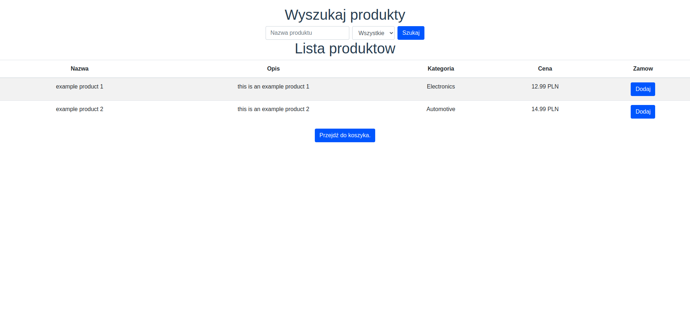
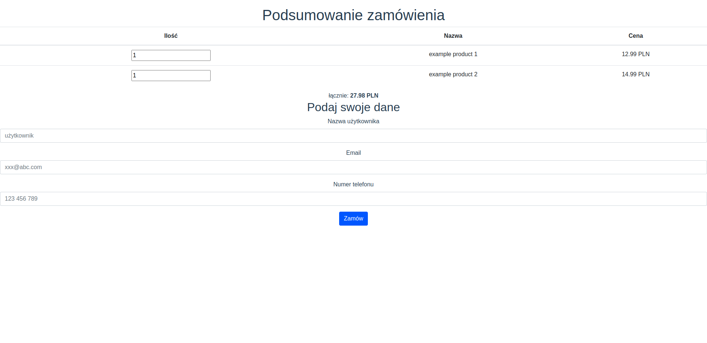

# ecommerce-app
fullstack web application written in Express and Vue

# Backend (Express)
- mongodb with declared schemas using mongoose
- orders, products and their categories
- API endpoints to recieve, create and update database 
- error handling

# Frontend (Vue.js)
- bootstrap css
- display products in form of a table
- product search
- cache state between different pages

# Screenshots
## application's main screen

## order page
